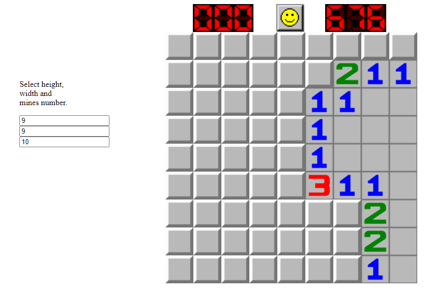

# Minesweeper Web Implementation
 Vanilla js Minesweeper web version. 1:1 re-implementation of Microsoft Windows's original game.



## How to Run
1. Clone this repository
2. Open `index.html` in your web browser
   - You can do this by double-clicking the file
   - Or using a local server (recommended):
     ```bash
     # Using Python
     python -m http.server
     
     # Using Node.js (if you have http-server installed)
     npx http-server
     ```
3. Open your browser and navigate to `http://localhost:8000` (or the port shown in your terminal)
